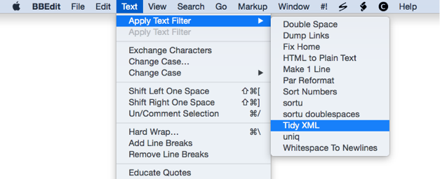

text-filters
============

Text Filters designed to be used with [BBEdit].

[BBEdit]: http://www.barebones.com/products/bbedit/

## Installation

If you are using Dropbox to sync your BBEdit text filters,
then these should be placed in this folder:

	$HOME/Dropbox/Application Support/BBEdit/Text Filters/

otherwise put them in

	$HOME/Library/Application Support/BBEdit/Text Filters/

## Make Executable

These text filters are shell scripts, and so they should be executable:

	cd "$HOME/Dropbox/Application Support/BBEdit/Text Filters/"

	chmod 755 *

## Naming

Whatever names you give to the filenames will be the names which appear in the
`Text Filters` menu, as shown here:

For GitHub, I replace spaces with `-` to avoid getting `%20` in filenames, and
I use suffixes, so the files can be previewed correctly.

But, when I put them into my `Text Filters` folder, I change the `-` back to a
space and drop the suffixes, because I think it makes the menus look better.

## “Useless” use of `cat`

Yes, sometimes I use

	cat "$@" | foo

instead of

	foo < "$@"

etc.

I have found that this works more reliably for me, so I prefer it.

I also find it easier to read. (You are complete free to feel differently.)

